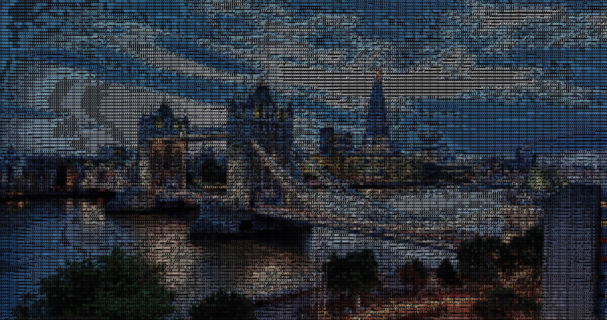
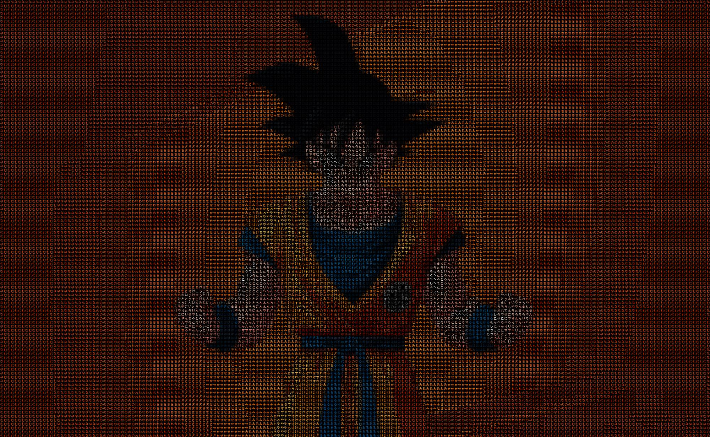
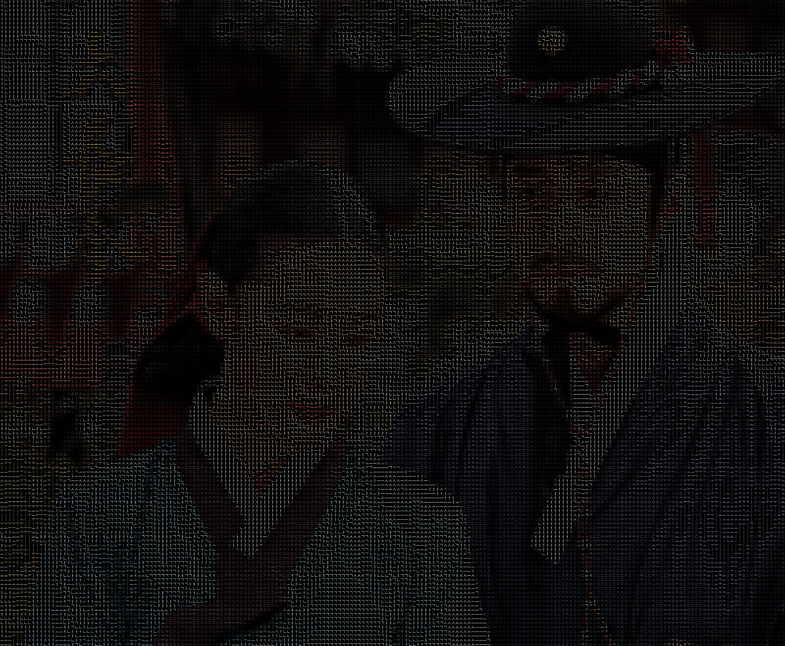
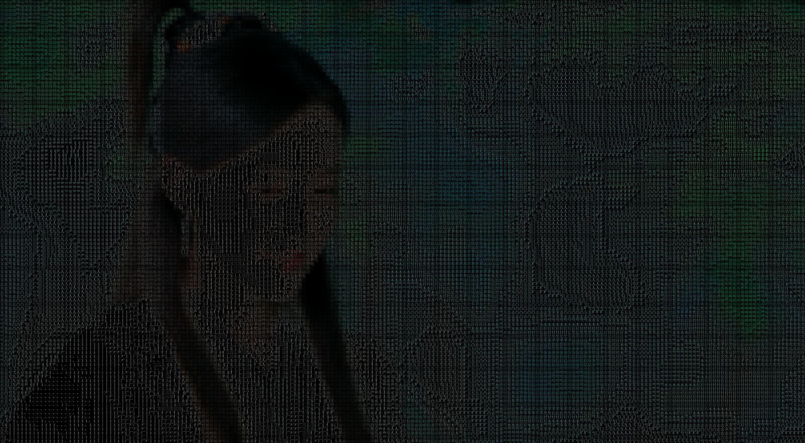
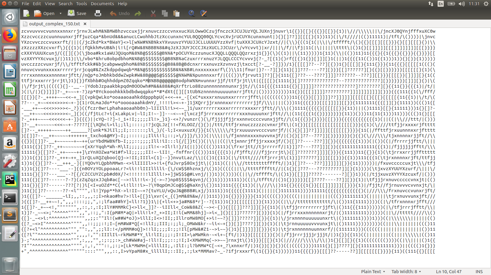
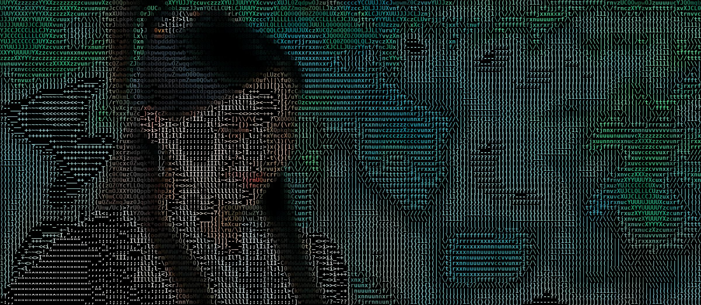
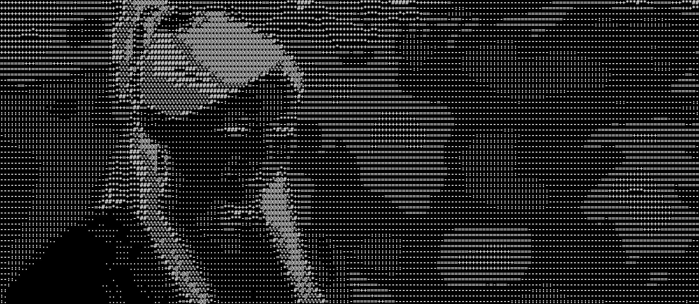
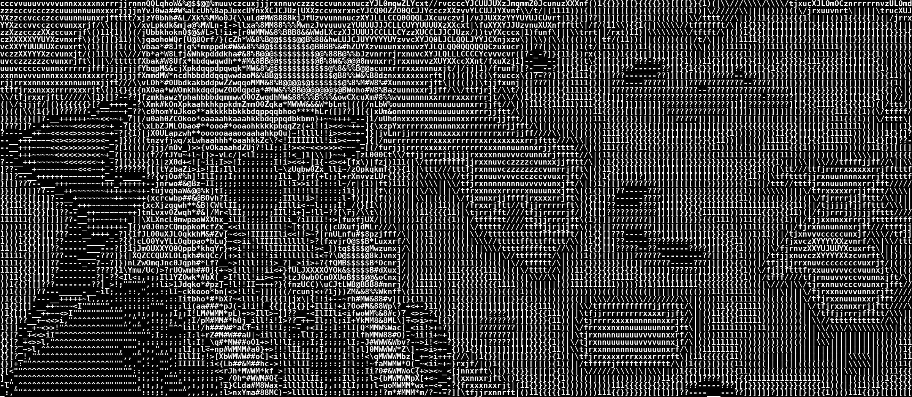

# [Python] ASCII 生成器

## 简介

这是一个基于 Python 的 ASCII 艺术生成器。它可以实现以下功能：
- **输入图片，生成以 ASCII 艺术表示的文本文件（.txt 格式），支持多种语言。**
- **输入图片，生成以 ASCII 艺术表示的图片文件（.png、.jpg 等格式）。可选择黑底白字或白底黑字两种模式。**
- **输入视频，生成以 ASCII 艺术表示的视频文件（.avi、.mp4 等格式）。**
- **生成的图片和视频可以选择灰度或彩色模式，完全由你决定。**

## 多语言支持

支持使用不同语言的字符生成 ASCII 艺术（如英语、德语、法语、韩语、中文、日语等）。以下是一些示例：

   
  <i>英语</i>

   
  <i>日语（龙珠）</i>

   
  <i>德语</i>

   
  <i>韩语（大长今）</i>

   
  <i>法语</i>

   
  <i>中文（明星画像）</i>

   
  <i>西班牙语</i>

   
  <i>俄语</i>

## 视频转视频

运行 **video2video_color.py** 或 **video2video.py** 并调整 *background* 和 *mode* 参数，可以生成不同效果的 ASCII 视频。例如：

   
  <i>彩色复杂字符 ASCII 输出</i>

   
  <i>白底简单字符 ASCII 输出</i>

## 图片转文本

运行 **img2txt.py** 并调整 *mode* 参数，可以生成以下不同效果的输出：

   
  <i>输入图片</i>

   
  <i>简单字符 ASCII 输出</i>

   
  <i>复杂字符 ASCII 输出</i>

## 图片转图片

运行 **img2img_color.py** 或 **img2img.py** 并调整 *background* 和 *mode* 参数，可以生成以下效果：

   
  <i>输入图片</i>

   
  <i>彩色复杂字符 ASCII 输出</i>

   
  <i>白底简单字符 ASCII 输出</i>

   
  <i>黑底简单字符 ASCII 输出</i>

   
  <i>白底复杂字符 ASCII 输出</i>

   
  <i>黑底复杂字符 ASCII 输出</i>

## 环境要求

- **Python 3.6 或更高版本**
- **cv2**
- **PIL**
- **numpy**